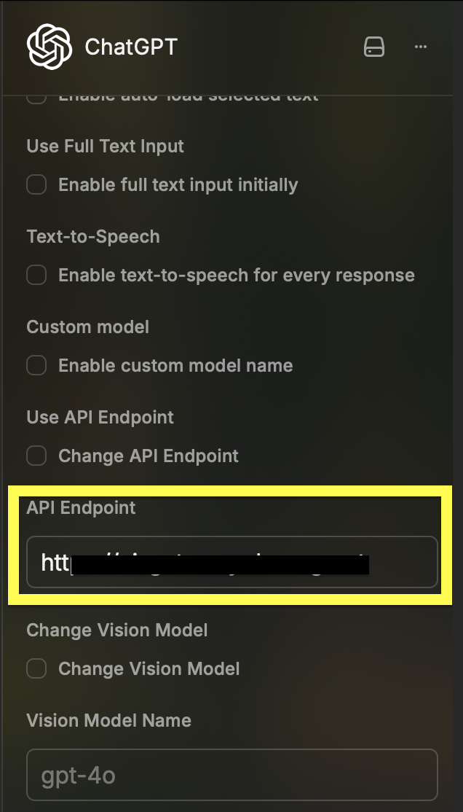

<p align="center">

</p>

<h1 align="center">ChatGPT</h1>

<h3 align="center">
A fork of the Raycast ChatGPT Extension
</h3>


# About

This is a fork of the [official ChatGPT extension for Raycast](https://www.raycast.com/abielzulio/chatgpt), enhanced with additional features and improvements. It allows you to interact with OpenAI's ChatGPT directly from your command bar.

# Getting Started

## Setup

Clone the repository and start the development server:

```sh
git clone <repo>
cd chatgpt
npm install
npm run dev
```

Once the extension is up and running, you can close the terminal – ctrl/cmd + z

###

### Authentication Setup

To use this extension, you'll need to provide your OpenAI API Bearer token:




# Features

### Ask anything, from your favorite thing

Straight from your command bar, ask anything you want and get an AI-generated answer without any effort.


### Personalized for you, really

Customize the model to your liking. Create and edit custom engines beyond your creativity.


### Keep continue, with you

Continue talking about everything right where you left off. Start from where you ended, not from zero.


### Save the answer, for later

Got the answer that you wanted? Great. Now you can save it without asking again.


# Contributing

Feel free to contribute to this fork by submitting issues or pull requests. Please follow the standard GitHub flow for contributions.

# License

This project is licensed under the MIT License - see the LICENSE file for details.

# Credits

Original extension by [abielzulio](https://github.com/abielzulio) and [contributors](https://www.raycast.com/abielzulio/chatgpt).
